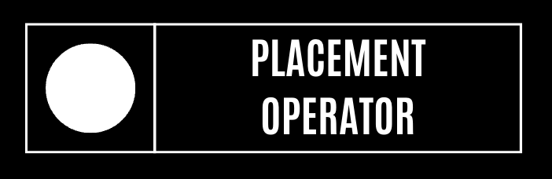
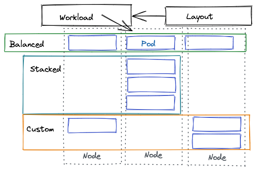
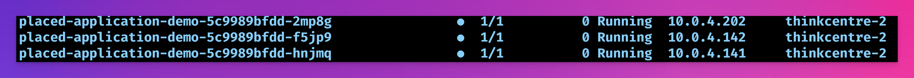

Dynamically change workload affinity in Kubernetes. Useful for testing, development and reacting to environmental changes.




### Custom resource

The custom resource is called **Layout** and is defined as follows:
```
apiVersion: core.cnskunkworks.io/v1alpha1
kind: Layout
metadata:
  name: layout-sample
spec:
  # balanced | stacked 
  strategy: stacked
  admissionOnly: true
```

  To utilise this resource a workload must use `spec.template.metadata.labels` 

```
spec:
  template:
    metadata:
      labels:
        app: placed-application-demo
        cnskunkworks.io/placement-operator-enabled: "true"
        cnskunkworks.io/placement-operator-layout: layout-sample
```


Setting a strategy will rebalance, this can be both **balanced** or **stacked** this can be updated dynamically within the layout custom resource and will recreate pods.




### TODO

- [ ] Add custom DSL to create layout conditions
- [ ] Add additional default layout types
- [ ] Allow for graceful pod termination and restart conditions