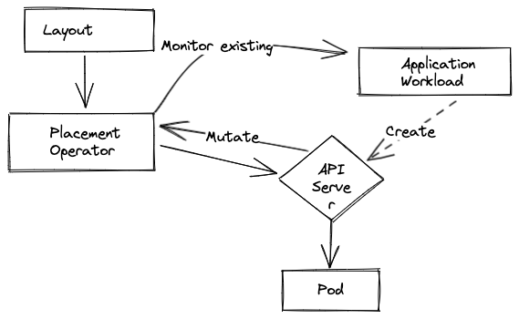
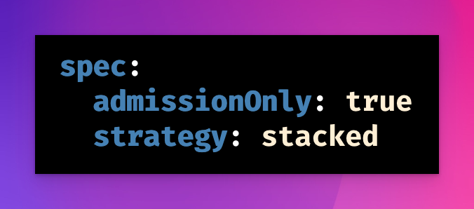

The placement operator allows for the dynamic rebalancing of deployments across a set of nodes. It is designed to be used in conjunction with the placement controller.

This model allows for both admission and reconciliation of deployments. The operator will watch for deployments and pods and will attempt to rebalance them across the nodes. The operator will also watch for nodes and will attempt to rebalance deployments across the nodes.

#### core.cnskunkworks.io/v1alpha1/layout

Setting a strategy will rebalance, this can be both **balanced** or **stacked**

